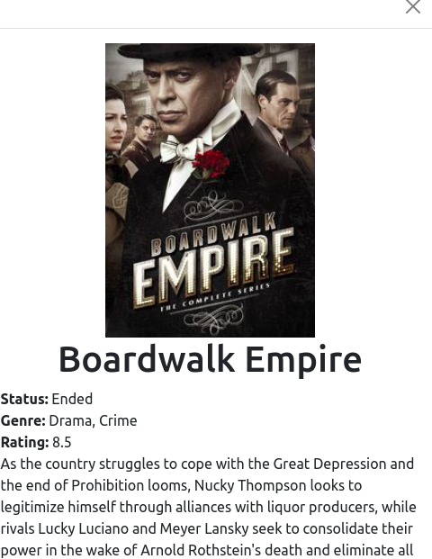

# Love4TV - Jose Abel Ramirez Frontany and ThankGod Richard

This project consist on the Microverse JavaScript capstone project where we build own web application based on 2 externals API. The API's we choose are https://www.tvmaze.com/api and the API provided by Microverse https://www.notion.so/microverse/Involvement-API-869e60b5ad104603aa6db59e08150270

This webapp have 2 user interfaces since we are a team of 2 members, the interfaces are:

- A home page showing a list of shows that can be "liked."
- A popup window with more data about the selected show that a user can use to comment on it.




## Video Recording

https://www.loom.com/share/32bad3619e0549469968836a13923858

## Built With

- HTML
- CSS
- JavaScript
- Webpack
- Babel
- Jest

## API's

- https://www.tvmaze.com/api
- https://www.notion.so/microverse/Involvement-API-869e60b5ad104603aa6db59e08150270

## Getting Started

To get a local copy up and running follow these simple example steps.

### Setup

Go to the top of the page, press te green button that says "Code", and copy the link. Then you have to go to your console and type

```
    git clone 'repository-link'
```

That's all, you are ready to go!

### Install

Run the following command to have all npm packages dependencies installed:

```
    npm install
```

### Usage

To start the webpack-dev-server, run the following command:

```
    npm run start
```

### Live Demo Server

<!-- - [live-version]() -->

### Tests with Jest framework

To run the tests files for Jest framework type the following

```
    npm test
```

### Linters

To run the Javascript linters type the following

```
    npx eslint .
```

To run the HTML linters type the following

```
    npx hint .

```

To run the CSS linters type the following

```
    npx stylelint "**/*.{css,scss}"
```

## Authors:

### Author: Jose Abel Ramirez Frontany\*\*

- GitHub: [Jose Abel Ramirez Frontany](https://github.com/jose-Abel)
- Linkedin: [Jose Abel Ramirez Frontany](https://www.linkedin.com/in/jose-abel-r-7674a842/)

### Author: ThankGod Richard\*\*

- Github: [ThankGod Richard](http://github.com/thankgodr)
- Linkedin: [ThankGod Richard](http://linkedin.com/in/thankgodr)

## 🤝 Contributing

Contributions, issues, and feature requests are welcome!

## 📝 License

This project is MIT licensed.

## Show your support

Give a ⭐️ if you like this project!
