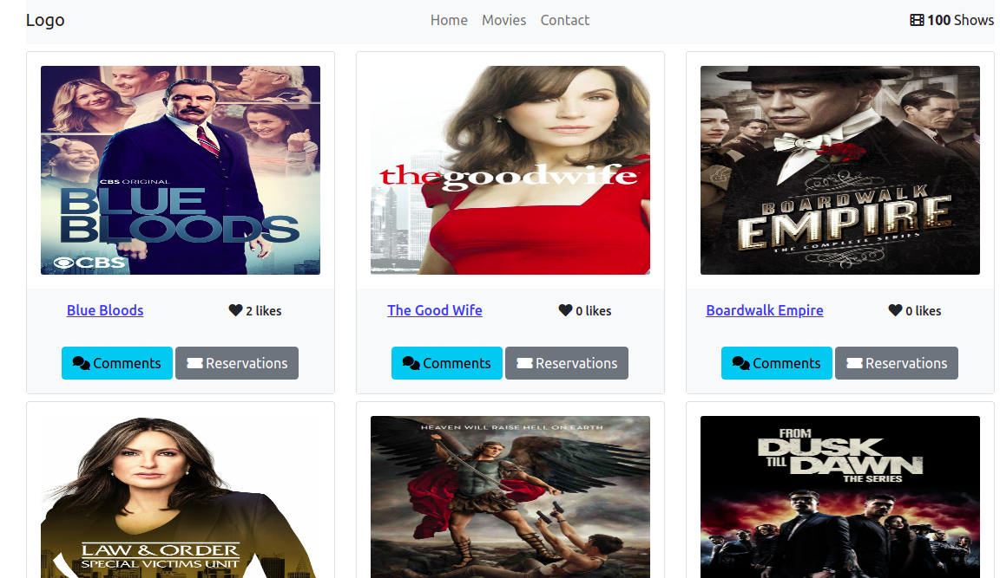

# LoveForTV - Jose Abel Ramirez Frontany and ThankGod Richard

<!--  -->

## Built With

- HTML
- CSS
- JavaScript
- Webpack
- Babel
- Jest

## Getting Started

To get a local copy up and running follow these simple example steps.

### Setup

Go to the top of the page, press te green button that says "Code", and copy the link. Then you have to go to your console and type

```
    git clone 'repository-link'
```

That's all, you are ready to go!

### Install

Run the following command to have all npm packages dependencies installed:

```
    npm install
```

### Usage

To start the webpack-dev-server, run the following command:

```
    npm run start
```

### Live Demo Server

- [live-version with github pages](https://jose-abel.github.io/todo-list/)

### Tests

Javascript linters

```
    npx eslint .
```

HTML linters

```
    npx hint .

```

CSS linters

```
    npx stylelint "**/*.{css,scss}"
```

## Authors:

### Author: Jose Abel Ramirez Frontany\*\*

- GitHub: [Jose Abel Ramirez Frontany](https://github.com/jose-Abel)
- Linkedin: [Jose Abel Ramirez Frontany](https://www.linkedin.com/in/jose-abel-ramirez-frontany-7674a842/)

### Author: Leonardo Lopes da Paz\*\*

- Github: [ThankGod Richard](http://github.com/thankgodr)
- Linkedin: [ThankGod Richard](http://linkedin.com/in/thankgodr)

## 🤝 Contributing

Contributions, issues, and feature requests are welcome!

## 📝 License

This project is MIT licensed.

## Show your support

Give a ⭐️ if you like this project!
